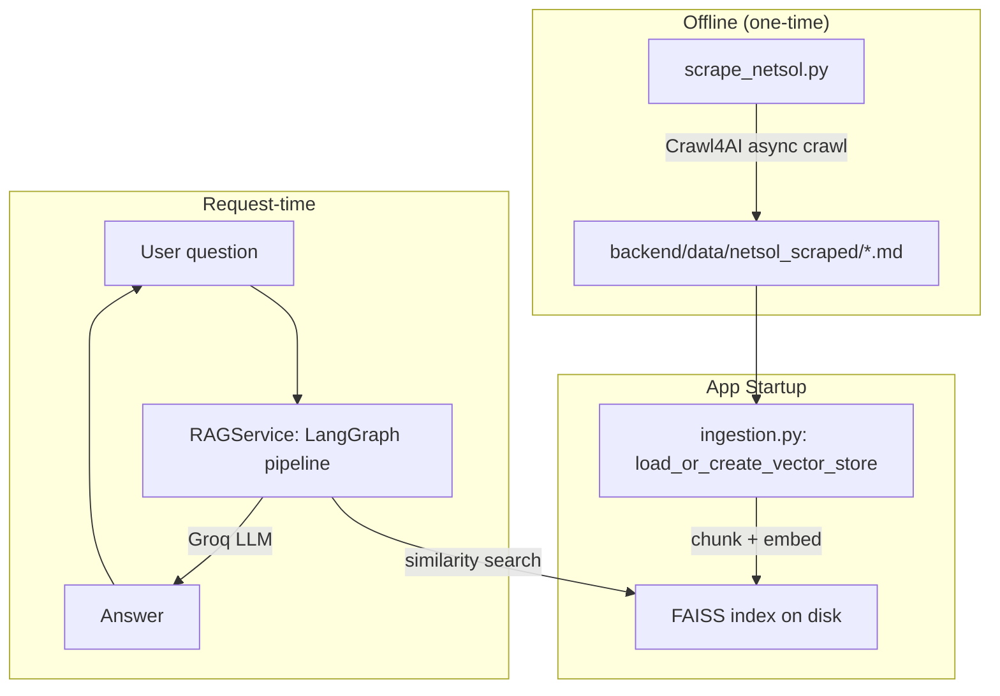

# Design Document: NetSol Website Chatbot

## Overview

This feature converts the existing Space Exploration RAG chatbot into a NetSol website assistant. The primary changes are:

1. A new standalone scraping script (`scrape_netsol.py`) uses Crawl4AI to crawl https://www.netsoltech.com and write one markdown file per page into `backend/data/netsol_scraped/`.
2. `backend/app/config.py` gains a `knowledge_dir` setting pointing at that scraped directory.
3. `backend/app/ingestion.py` is updated to load `.md`/`.txt` files from `knowledge_dir` when available, falling back to the existing single-file path.
4. `backend/app/rag.py` gets a NetSol-focused system prompt.
5. `crawl4ai` is added to `backend/requirements.txt`.

The LangGraph pipeline, FAISS vector store, Groq LLM, FastAPI backend, and React frontend are all unchanged structurally.

---

## Architecture



The scraper is entirely offline; it is run once by the developer before or after deployment. The rest of the system is unaffected by the source of the markdown files — as long as they land in `knowledge_dir`.

---

## Components and Interfaces

### 1. `scrape_netsol.py` (new — project root or `backend/`)

Standalone CLI script. No imports from `backend/app`.

```
Usage: python scrape_netsol.py [--output-dir PATH] [--max-pages N]
```

Responsibilities:
- Seed URL: `https://www.netsoltech.com`
- BFS/queue-based async crawl using `AsyncWebCrawler` from `crawl4ai`
- Filter links to same-domain only
- Deduplicate visited URLs
- Extract `result.markdown` (Crawl4AI's cleaned markdown output)
- Write `<slug>.md` per page to the output directory
- Log HTTP errors; continue on failure
- Print summary on completion

Key internal functions:
- `slugify(url: str) -> str` — converts a URL to a safe filename
- `crawl(seed: str, output_dir: Path, max_pages: int | None) -> CrawlSummary` — async entry point
- `main()` — CLI argument parsing + `asyncio.run(crawl(...))`

### 2. `backend/app/config.py` (modified)

New field added to `Settings`:

```python
knowledge_dir: Path = BASE_DIR / "backend" / "data" / "netsol_scraped"
```

`knowledge_file` is retained unchanged for backward compatibility.

### 3. `backend/app/ingestion.py` (modified)

`load_or_create_vector_store()` updated logic:

```
if faiss_index exists on disk:
    load and return it                    # unchanged
elif knowledge_dir is set and exists and contains .md/.txt files:
    load all files from knowledge_dir     # NEW path
else:
    load knowledge_file                   # existing fallback
```

New helper: `load_documents_from_dir(directory: Path) -> list[Document]`
- Globs for `*.md` and `*.txt`
- Calls `TextLoader` for each file
- Sets `metadata["source"]` to the file path string

### 4. `backend/app/rag.py` (modified)

`SYSTEM_PROMPT` updated:

```python
SYSTEM_PROMPT = (
    "You are a helpful assistant for the NetSol Technologies website. "
    "Answer questions strictly based on the supplied context about NetSol's products, "
    "services, and company information. "
    "If the context does not contain enough information to answer the question, "
    "say that you do not have information on that topic."
)
```

### 5. `backend/requirements.txt` (modified)

Added line:
```
crawl4ai==0.6.3
```
(pinned to latest stable at implementation time; update as needed)

---

## Data Models

### Scraped File Layout

```
backend/data/netsol_scraped/
  netsoltech-com.md          # home page
  netsoltech-com-about.md
  netsoltech-com-products-fleet-management.md
  ...
```

Filenames are derived from the URL path using `slugify`:
- Strip scheme + `www.`
- Replace `/` and non-alphanumeric characters with `-`
- Truncate at 200 characters to stay within filesystem limits

### Document Metadata

Each `Document` loaded from the scraped directory carries:

| Field    | Type   | Value                               |
|----------|--------|-------------------------------------|
| `source` | `str`  | Absolute path to the `.md` file     |

This matches what `TextLoader` provides by default and is consistent with the existing pipeline's `SourceChunk.source` field exposed in the API response.

### Config Settings (additions)

| Setting        | Type   | Default                                        |
|----------------|--------|------------------------------------------------|
| `knowledge_dir`| `Path` | `<BASE_DIR>/backend/data/netsol_scraped`       |

All existing settings remain unchanged.

### CrawlSummary (internal dataclass in scrape_netsol.py)

```python
@dataclass
class CrawlSummary:
    attempted: int
    succeeded: int
    failed: int
    failed_urls: list[tuple[str, str]]  # (url, reason)
```

---


## Correctness Properties

*A property is a characteristic or behavior that should hold true across all valid executions of a system — essentially, a formal statement about what the system should do. Properties serve as the bridge between human-readable specifications and machine-verifiable correctness guarantees.*

### Property 1: Same-domain URL filtering

*For any* list of URLs discovered on a page, only URLs whose hostname matches `netsoltech.com` (with or without `www.`) should be enqueued for crawling — all external URLs must be discarded.

**Validates: Requirements 1.1**

### Property 2: URL deduplication

*For any* sequence of URLs (possibly containing duplicates) fed into the crawl queue, each unique URL is visited at most once — the count of actual crawl calls equals the count of distinct URLs.

**Validates: Requirements 1.5**

### Property 3: File-per-page count

*For any* set of N pages successfully scraped, the output directory contains exactly N markdown files after the crawl completes.

**Validates: Requirements 1.6**

### Property 4: Max-pages limit

*For any* value N passed via `--max-pages`, the total number of pages crawled is always less than or equal to N, regardless of how many pages are discoverable.

**Validates: Requirements 1.9**

### Property 5: Directory loading with source metadata

*For any* directory containing one or more `.md` or `.txt` files, `load_documents_from_dir` returns a list of `Document` objects equal in count to the number of files, where every document has a non-empty `metadata["source"]` field containing the originating file path.

**Validates: Requirements 2.2, 2.3**

### Property 6: Chunk size invariant

*For any* document loaded by the ingestion pipeline, all chunks produced by `RecursiveCharacterTextSplitter` have `len(chunk.page_content) <= settings.chunk_size`.

**Validates: Requirements 3.2**

### Property 7: Existing dependencies retained

*For any* package that appears in the original `backend/requirements.txt`, that package name must also appear in the modified `requirements.txt` (the set of original packages is a subset of the new package set).

**Validates: Requirements 5.2**

---

## Error Handling

### Scraper

- Per-page errors (HTTP 4xx/5xx, network timeout, Crawl4AI exception) are caught inside the async crawl loop. The URL and reason are appended to `CrawlSummary.failed_urls`; the loop continues.
- If the output directory cannot be created (permission error), the script raises immediately with a clear message.
- If no pages succeed (all fail), the script exits with code 1 after printing the summary, so CI pipelines can detect a completely failed crawl.

### Ingestion

- If `knowledge_dir` exists but contains zero `.md`/`.txt` files, the pipeline logs a warning and falls back to `knowledge_file` rather than building an empty index.
- If both `knowledge_dir` is absent/empty and `knowledge_file` is missing, `load_or_create_vector_store` raises `FileNotFoundError` with a descriptive message (existing behavior preserved).
- Malformed or unreadable files in `knowledge_dir` are skipped with a warning log; other files are still ingested.

### Config

- All `Settings` fields have defaults, so the app starts without any `.env` customisation. Missing `GROQ_API_KEY` is caught at `RAGService.__init__` time (existing behavior).

---

## Testing Strategy

### Dual Testing Approach

Both unit tests and property-based tests are required. They are complementary:

- **Unit tests** cover specific examples, integration points, and error conditions.
- **Property tests** verify universal invariants across many generated inputs.

### Property-Based Testing

Library: **`hypothesis`** (Python) — the standard PBT library for Python.

Each property test runs a minimum of **100 iterations** (Hypothesis default; can be raised with `@settings(max_examples=200)`).

Each test is annotated with a comment referencing the design property it validates:

```python
# Feature: netsol-website-chatbot, Property 2: URL deduplication
```

Property test file: `backend/tests/test_properties.py`

| Design Property | Test Description |
|-----------------|-----------------|
| P1 — URL filtering | Generate arbitrary URLs; assert `is_internal(url)` returns True only for `netsoltech.com` variants |
| P2 — URL deduplication | Generate lists of URLs with duplicates; assert crawl queue contains only unique URLs |
| P3 — File-per-page count | Generate N mock page results; assert output dir has N files |
| P4 — Max-pages limit | Generate (pages_available, max_pages) pairs; assert crawled count <= max_pages |
| P5 — Directory loading + source | Generate tmp dirs with random .md files; assert doc count == file count and all have source |
| P6 — Chunk size invariant | Generate random text documents; assert all chunks <= chunk_size |
| P7 — Existing deps retained | Parse original requirements list; assert all entries present in new list |

### Unit Tests

Unit test file: `backend/tests/test_unit.py`

Specific examples to cover:

- `slugify` produces safe filenames from various URL shapes (no `/`, `?`, `#`, spaces)
- HTTP error during crawl is recorded in `CrawlSummary.failed` and crawl continues
- `--output-dir` CLI arg routes output correctly
- `--max-pages` CLI arg is parsed and passed to crawl function
- `Settings.knowledge_dir` defaults to the expected path
- `load_or_create_vector_store` calls `FAISS.load_local` when index dir exists (not `from_documents`)
- `load_or_create_vector_store` falls back to `knowledge_file` when `knowledge_dir` is absent
- Index is persisted to `faiss_index_dir` after a fresh build
- `SYSTEM_PROMPT` contains "NetSol" and "context"
- `backend/requirements.txt` contains a `crawl4ai` line
