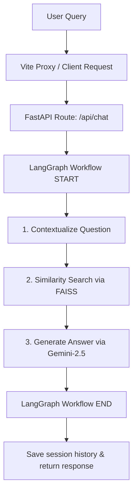

# 🤖 NetSol RAG Chatbot Backend API Documentation

A high-performance, history-aware Retrieval-Augmented Generation (RAG) chatbot backend built with **FastAPI**, **LangChain**, **LangGraph**, and **FAISS**. This service is powered by the **Google Gemini (gemini-2.5-flash)** chat model and **Gemini Embeddings** to provide context-enriched answers about corporate documents and web scraped data.

Designed with robust inputs, modular schemas, and non-blocking asynchronous RAG pipeline loading to facilitate seamless integration with custom frontends (e.g., Lovable, Next.js, or React).

---

## 🏗️ Architecture & Flow

The chatbot leverages a multi-step RAG state machine implemented with **LangGraph** to process user queries sequentially:



1. **Contextualize Question**: Re-writes follow-up questions into search-friendly standalone queries based on history.
2. **Similarity Search**: Queries the local FAISS index containing pre-chunked markdown/text/docx documents to retrieve the top $K$ relevant chunks.
3. **Generation**: Composes a concise, strictly context-bounded response using Gemini and returns the retrieved sources.

---

## ⚙️ Environment Configuration

The backend is configured via a `.env` file located in the `backend/` directory.

| Variable | Type | Default Value | Description |
| :--- | :--- | :--- | :--- |
| `APP_NAME` | String | `NetSol Website Chatbot` | The FastAPI server name. |
| `BACKEND_HOST` | String | `127.0.0.1` | Host IP address the server binds to. |
| `BACKEND_PORT` | Integer | `8000` | Port the server runs on. |
| `GEMINI_API_KEY` | String | *Required* | API key for Gemini access. |
| `GEMINI_EMBEDDING_MODEL` | String | `gemini-embedding-001` | Model used for embedding document chunks. |
| `GEMINI_CHAT_MODEL` | String | `gemini-2.5-flash` | LLM used for answering questions. |
| `CHUNK_SIZE` | Integer | `900` | Size of split document text chunks. |
| `CHUNK_OVERLAP` | Integer | `180` | Overlapping token size between chunks. |
| `TOP_K` | Integer | `4` | Number of context chunks retrieved. |
| `KMP_DUPLICATE_LIB_OK` | String | `TRUE` | Prevents Intel OpenMP thread duplicate library errors. |

---

## 🔌 API Endpoints & Contract

> [!NOTE]
> All request payloads and response bodies use JSON. Ensure your frontend sends the header: `Content-Type: application/json`.

### 1. Health Check
Checks if the web server is online. This endpoint returns immediately on server start without waiting for the heavy machine learning libraries or vector stores to finish loading.

* **URL**: `/health`
* **Method**: `GET`
* **Auth Required**: No
* **Query Parameters**: None
* **Success Response (200 OK)**:
  ```json
  {
    "status": "ok"
  }
  ```

---

### 2. Chat Conversation
Processes a user query, retrieves relevant document chunks, utilizes session chat history, and returns a contextual response.

* **URL**: `/api/chat`
* **Method**: `POST`
* **Auth Required**: No
* **Request Body Schema (`ChatRequest`)**:
  | Field | Type | Rules / Validation | Description |
  | :--- | :--- | :--- | :--- |
  | `session_id` | String | Required, Min Length: `1` | A unique string identifier tracking the user conversation state. |
  | `message` | String | Required, Min Length: `1` | The raw text query submitted by the user. |

* **Response Body Schema (`ChatResponse`)**:
  | Field | Type | Description |
  | :--- | :--- | :--- |
  | `session_id` | String | The session identifier matching the request. |
  | `answer` | String | The generated answer from the Gemini assistant. |
  | `sources` | Array of `SourceChunk` | List of original documents and metadata used to construct the answer. |
  | `history` | Array of messages | Full conversation history snapshot for the current session. |

* **Sub-Schema: `SourceChunk`**:
  | Field | Type | Description |
  | :--- | :--- | :--- |
  | `content` | String | The plain text chunk retrieved from the FAISS database. |
  | `source` | String / Null | File path or URL indicating where the chunk originated. |
  | `score` | Float / Null | Similarity match score (Euclidean distance - lower is more similar). |

* **Sub-Schema: Chat History Message**:
  | Field | Type | Allowed Values | Description |
  | :--- | :--- | :--- | :--- |
  | `role` | String | `"user"`, `"assistant"`, `"system"` | The sender of the message. |
  | `content` | String | | The text content of the message. |

#### Example Request:
```json
{
  "session_id": "session-123456",
  "message": "What products does NetSol offer?"
}
```

#### Example Success Response (200 OK):
```json
{
  "session_id": "session-123456",
  "answer": "NetSol Technologies offers several premier products, including NFS Ascent, an end-to-end platform for the asset finance and leasing industry.",
  "sources": [
    {
      "content": "NFS Ascent is designed to meet the challenges of the asset finance and leasing industry, providing retail and wholesale finance systems...",
      "source": "d:\\Course Documents\\Projects\\RAG_Chatbot\\backend\\data\\netsol_scraped\\ascent_platform.md",
      "score": 0.43521
    }
  ],
  "history": [
    {
      "role": "user",
      "content": "What products does NetSol offer?"
    },
    {
      "role": "assistant",
      "content": "NetSol Technologies offers several premier products, including NFS Ascent..."
    }
  ]
}
```

#### Potential Error Responses:
* **422 Unprocessable Entity**: Request body failed validation (e.g. `session_id` or `message` is empty).
  ```json
  {
    "detail": [
      {
        "type": "string_too_short",
        "loc": ["body", "message"],
        "msg": "String should have at least 1 character"
      }
    ]
  }
  ```
* **503 Service Unavailable**: The RAG service (LangChain and FAISS) is still loading in the background thread. Usually occurs within the first 10-30 seconds of backend startup.
  ```json
  {
    "detail": "RAG service is still initializing. Please try again in a moment."
  }
  ```
* **500 Internal Server Error**: The background loading task encountered a fatal error (e.g. missing API key, corrupt index files).
  ```json
  {
    "detail": "RAG service failed to initialize. Error: GEMINI_API_KEY is not set."
  }
  ```

---

## 🛠️ Local Installation & Launch

### Prerequisites
* Python 3.9 to 3.11
* A Google Gemini API Key

### Step-by-Step Setup
1. **Navigate to backend folder**:
   ```bash
   cd backend
   ```
2. **Create and activate Virtual Environment**:
   ```bash
   python -m venv .venv
   # Windows:
   .venv\Scripts\activate
   # macOS/Linux:
   source .venv/bin/activate
   ```
3. **Install Dependencies**:
   ```bash
   pip install -r requirements.txt
   ```
4. **Environment Variables Configuration**:
   Create a `.env` file inside `backend/` and insert your API Key:
   ```env
   GEMINI_API_KEY=AIzaSyYourGeminiApiKeyHere
   ```
5. **(Optional) Rebuild Vector Database**:
   If you change the source documents, clean or scrape new data, rebuild the FAISS store:
   ```bash
   python run_ingestion.py
   ```
6. **Start the API Server**:
   ```bash
   uvicorn main:app --reload --port 8000
   ```
   The backend API will run at `http://127.0.0.1:8000` (IPv4) or `http://[::1]:8000` (IPv6).

---

## ⚡ Connecting a Lovable (or External) Frontend

When launching your frontend on a separate service (e.g. Lovable sandbox, Vercel, Netlify, or local port `5173`), ensure the following configurations are met:

### 1. CORS Headers
The backend comes pre-configured to allow requests from local frontend ports (`http://localhost:5173` and `http://127.0.0.1:5173`).
To connect from a public Lovable URL, update the **CORS Middleware** origins in [backend/main.py](file:///d:/Course%20Documents/Projects/RAG_Chatbot/backend/main.py):
```python
app.add_middleware(
    CORSMiddleware,
    allow_origins=[
        "http://localhost:5173",
        "http://127.0.0.1:5173",
        "https://your-lovable-app-domain.lovable.app"  # Add your Lovable domain here
    ],
    allow_credentials=True,
    allow_methods=["*"],
    allow_headers=["*"],
)
```

### 2. Proxy Configuration (Vite/Local Development)
If you run Vite locally, configure `vite.config.js` to route backend API requests:
```javascript
export default defineConfig({
  server: {
    proxy: {
      '/api': 'http://127.0.0.1:8000',
      '/health': 'http://127.0.0.1:8000'
    }
  }
});
```

### 3. API Integration Code (JavaScript Fetch)
You can directly make requests from the Lovable code to the backend endpoints:

```javascript
const BACKEND_URL = "https://your-deployed-backend-url.com"; // Or "http://localhost:8000" locally

// 1. Check health
async function checkBackendHealth() {
  try {
    const res = await fetch(`${BACKEND_URL}/health`);
    const data = await res.json();
    return data.status === "ok";
  } catch (err) {
    console.error("Backend offline", err);
    return false;
  }
}

// 2. Chat request
async function sendChatMessage(sessionId, messageText) {
  const res = await fetch(`${BACKEND_URL}/api/chat`, {
    method: "POST",
    headers: {
      "Content-Type": "application/json"
    },
    body: JSON.stringify({
      session_id: sessionId,
      message: messageText
    })
  });
  
  if (!res.ok) {
    const errorText = await res.text();
    throw new Error(errorText || `HTTP error ${res.status}`);
  }
  
  return await res.json(); // Returns { session_id, answer, sources, history }
}
```